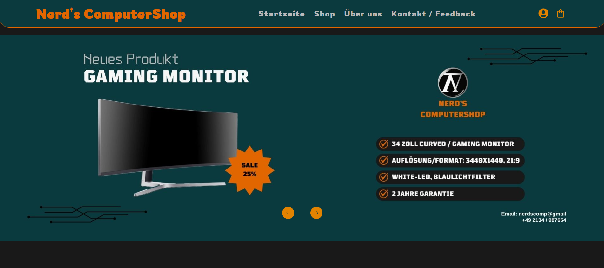

<h1 align="center">Nerd's ComputerShop 💻</h1>
<p align="center">
    A full-featured online computer store built with <a href="https://reactjs.org/">React</a> and <a href="https://redux.js.org/">Redux</a>, featuring user authentication, a shopping cart with tiered discounts, and real Stripe payment integration.
</p>

## Live Demo

🔗 [View live here](https://nerd-s-computershop.netlify.app)



## 🛠️ Features

- ✔️ Product catalog with category filtering (PCs, Laptops, Monitors, Keyboards, Mice)
- ✔️ Shopping cart with quantity management, powered by Redux Toolkit
- ✔️ Tiered discount system (5% from €200, 10% from €300, 15% from €500)
- ✔️ User login via Auth0 (email/password or Google)
- ✔️ Real payment processing via Stripe (test mode), protected behind login
- ✔️ Server-side price validation to prevent price manipulation
- ✔️ Persistent cart and login session across page reloads (localStorage)
- ✔️ Responsive design for mobile, tablet, and desktop

## Technologies Used

**Frontend:**
- React 18
- Redux Toolkit
- React Router
- Auth0 (React SDK)
- Stripe.js
- Framer Motion / AOS

**Backend:**
- Node.js / Express
- Stripe API (server-side checkout session creation & price validation)

## Project Structure

```
├── public/                      # Static assets (images, icons)
├── src/
│   ├── auth/                    # Auth0 provider setup
│   ├── components/
│   │   ├── Buttons/
│   │   ├── Cart/                # Shopping cart components
│   │   ├── Filter/              # Category filter
│   │   ├── ProductComponent/    # Product cards & details
│   │   └── UI/                  # Header, Footer, Slider, Services, Team
│   ├── data/                    # Product, slider, service & team data
│   ├── Layout/
│   ├── pages/
│   │   ├── About/
│   │   ├── checkout/            # Checkout success & cancel pages
│   │   ├── contact/
│   │   ├── home/
│   │   └── shop/
│   ├── redux/                   # State management (cart, products)
│   ├── routers/
│   ├── services/                # Stripe checkout API calls
│   ├── App.css
│   ├── App.js
│   ├── index.js
│   └── reportWebVitals.js
├── stripe-server/               # Node/Express backend for payment processing
│   ├── data/                    # Server-side product data (price validation)
│   ├── utils/                   # Discount calculation logic
│   └── index.js
└── compress_images.py           # One-off script for optimizing team photos (Pillow)
```

## Note

This project runs in Stripe test mode - no real payments are processed. The `stripe-server` backend is deployed separately on Render.

All product images were obtained from open sources and are presented here for informational purposes only.

## Contact

Feel free to reach out via GitHub or Instagram:
- GitHub: [@VampireNoob](https://github.com/VampireNoob)
- Instagram: [@vampirenoob](https://www.instagram.com/vampirenoob/)